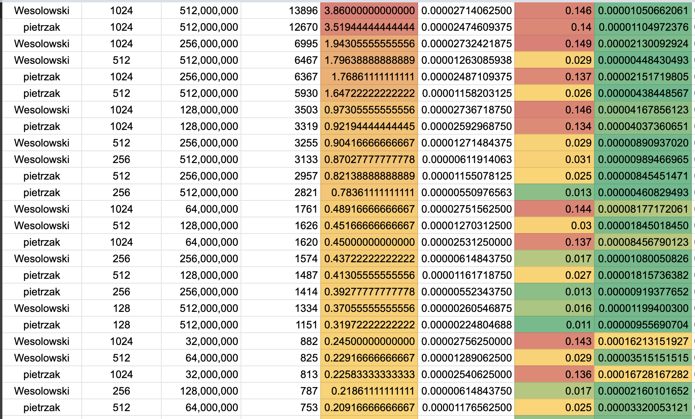
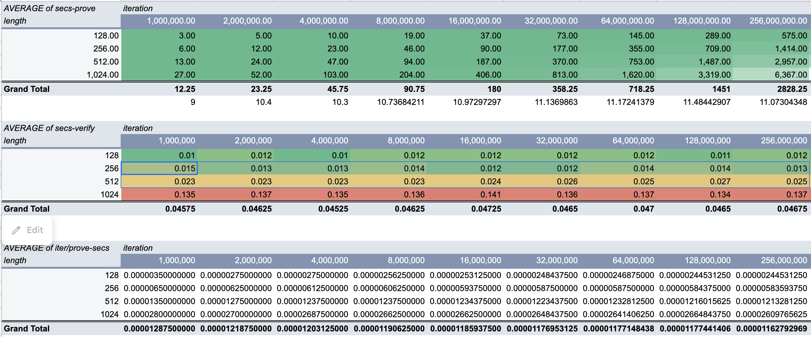
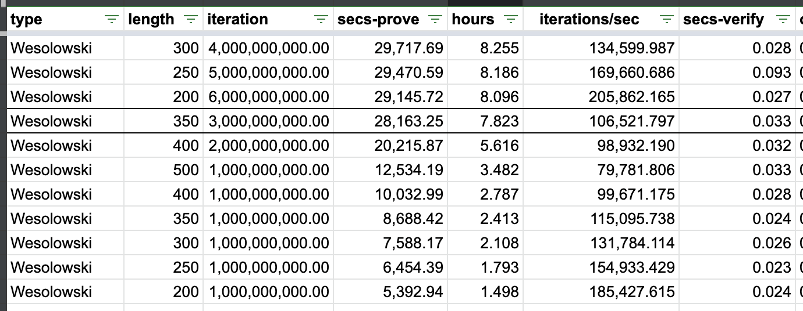

# Miner Difficulty Upgrade

TL;DR: The verifying of miner proofs is too costly on the CPU usage of the network. Additionally there is congestion at the start of epochs as miners submit stockpiled proofs. Some solutions were devised: 

1. slightly random parameters to prevent stockpiling across epochs and creating congestion.
1. consolidate prover work into longer proofs (which take hours) instead of many (minutes).
1. use a different security parameter baseline for proofs to be verified faster.

## Benchmarking length and security parameters.

A first batch of VDF were tested altering three variables alogrith (wesolowski vs. pietrzak), security parameter (128, 256, 512, 1024), and number of iterations (32m, 63m, etc, to 512m).

(TODO: What were the specs and architecture of the machines)

### Round 1

The first results.

The analysis showed clearly that the biggest impact on performance is the security parameter:

### Round 2

We then narrowed the parameter search, with more granularity. Wesolowski was chosen because the number of iterations necessary to generate long proofs (constrained by the library) was not possible with Pietrzak.

There is a clear banding around 8 hours, and then a dropoff from 8h to 5.5h.

# Conclusion

Of the four candidates for an approx 8 hour VDF. We discard the most expensive to verify.

The remaining three have similar verification times (approximately 0.03s). So of the three we choose the one with the highest security parameter.

<b>
The selected baseline parameter for VDFs:

## Wesolowski, 350 bits, 3 billion iterations.
</b>

Note that the security parameter is a "baseline" which changes slightly by single digits each epoch, via a number generator (based on VDF proofs themselves) to prevent stockpiling.